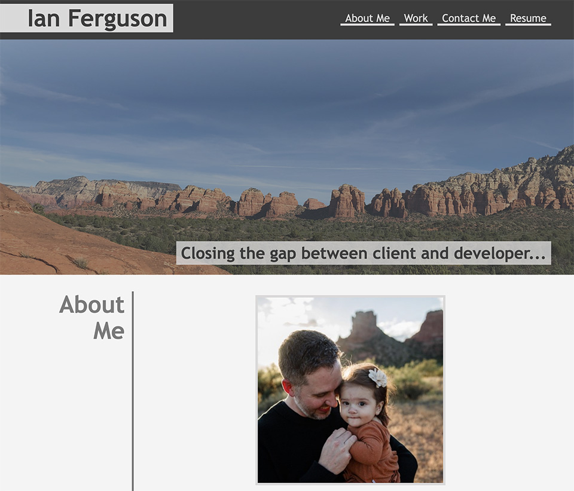

# Bootcamp Student Portfolio

---


## Description

Hello! My name is Ian Ferguson, and I am currently a student in the Coding Bootcamp at Arizona State University. We have been tasked with making a [Portfolio](https://temptag.github.io/Portfolio/) page to showcase our projects throughout the Bootcamp, and this is that web application! This Portfolio will evolve over time, starting out with basic html and css, and adding technologies as I learn and grow. Thank you for reading!



## Features

- **Semantic HTML**: The webpage utilizes semantic elements and alt tags for accessibility
- **Responsive Layout**: The webpage is responsive to various devices and screen sizes
- **Project Links**: Interactive elements providing links to my school projects
- **Contact Information**: A section to be able to contact me directly and link to my current LinkedIn profile

  _The assignment ReadMe.md can be seen [HERE](./assets/assignment/README.md) to review the outline for this project._

## Technologies Used

- HTML5
- CSS3
- _more to come..._

## Installation

The Portfolio webpage can be accessed directly [HERE](https://temptag.github.io/Portfolio/) as it is hosted on GitHub Pages.

If you would like to utilize the project locally, you can clone the project down following these steps:

1. My GitHub repository for this project can be accessed directly [HERE](https://github.com/TEMPTAG/Portfolio)
2. In the top right, you can click the `<> Code` drop-down menu to select the appropriate local coding address for your usage
3. Navigate to your terminal to clone the repository:
   ```bash
   git clone https://github.com/TEMPTAG/Portfolio.git
   ```
4. Navigate to the project directory:
   ```bash
   cd portfolio
   ```
5. Open `index.html` in your preferred web browser:
   ```bash
   open index.html
   ```
6. _Optional step, you can open the project in VSCode by_:
   ```bash
   code .
   ```

---

## Related Projects

I will link the related projects in the portfolio here once they are completed and added to this webpage.

---

## Credits

As much as I would love to thank my wife, my parents, instructors, TAs, etc. as they are the people who got me to this point, as well as welcome contributions from other students and developers, this is a solo project to showcase my personal work. I welcome - and whole-heartedly request - input, feedback, criticisms, etc... so please reach out through the contact information below for any and all inquiries!

---

## Contact

- [Email](mailto:iansterlingferguson@gmail.com)
- [LinkedIn](https://www.linkedin.com/in/ianferguson/)
- [GitHub](https://github.com/TEMPTAG)

---

## License

This student project is under the MIT License. The details of the [LICENSE](./LICENSE) can be seen in the linked file.

_Copyright (c) 2024 Ian Ferguson_
